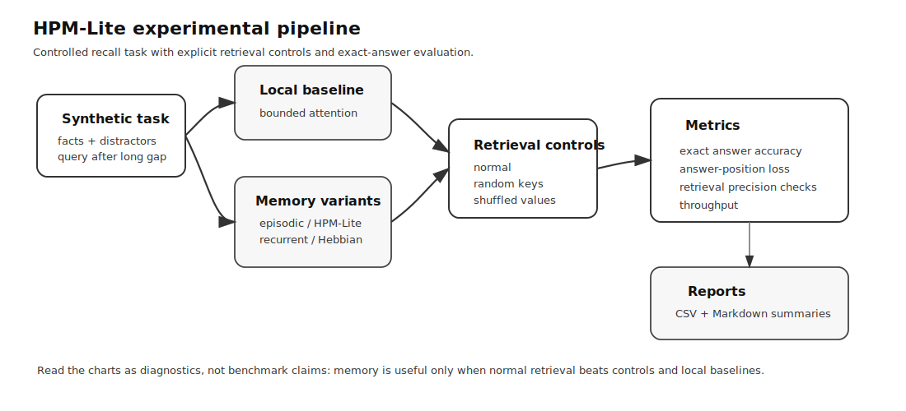
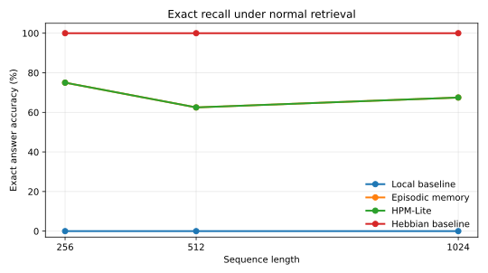
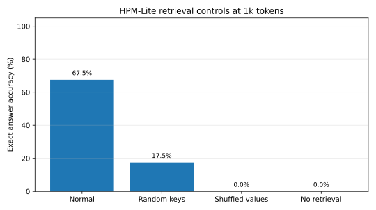

# HPM-Lite

[](https://www.python.org/)
[](https://pytorch.org/)
[](#tests)
[](#status)

Small PyTorch testbed for controlled experiments on memory-augmented sequence models.

HPM-Lite asks a narrow question: when a fact appears early in a sequence and the query appears after a long distractor gap, can a small memory mechanism recover the exact answer better than a local-attention baseline?

This is not a production model, benchmark submission, or Transformer-replacement claim. It is a compact research repo for testing exact recall, retrieval controls, and structured memory diagnostics.

<p align="center">
  
</p>

## What this repository demonstrates

- Python and PyTorch implementation
- synthetic sequence-task generation
- local-attention and memory-augmented baselines
- exact answer-token evaluation
- retrieval controls for shortcut and leakage checks
- CSV and Markdown reporting
- basic tests and CPU smoke runs

## Scope

Included:

- local baseline
- recurrent summary baseline
- episodic memory model
- combined HPM-Lite model
- Hebbian-style associative-memory baseline
- validation controls
- structured memory diagnostics
- experiment reports

Not included:

- large-scale pretraining
- ANN-backed retrieval
- distributed training
- learned autonomous memory writing
- JEPA-style latent prediction
- full multi-path routing
- claims of general long-context reasoning

## Quick results

These plots are generated from the result summaries included with the repository. They are meant to show diagnostic behavior, not leaderboard performance.

<p align="center">
  
</p>

<p align="center">
  
</p>

A useful memory result should satisfy both conditions:

1. normal retrieval improves exact recall over the local baseline;
2. accuracy drops under controls such as shuffled values, random keys, or no retrieval.

If performance survives the controls unchanged, the model may be using a shortcut rather than memory.

## Repository layout

```text
hpm_lite/        Core package
scripts/         Experiment and validation runners
tests/           Basic test coverage
docs/            Reports and result notes
assets/          README figures
requirements.txt Python dependencies
README.md        Project overview
```

Generated artifacts such as checkpoints, raw run folders, logs, and `__pycache__` files are intentionally excluded from the GitHub-ready version.

## Install

```bash
git clone https://github.com/felixpatriciorei/HPM-Lite.git
cd HPM-Lite
pip install -r requirements.txt
```

The code uses synthetic data and does not require an external dataset.

## Smoke test

```bash
python scripts/run_smoke.py
```

This runs a short CPU sanity check for the core model variants and verifies that losses, exact accuracy, and retrieval metrics run without NaNs.

## Train a model

```bash
python -m hpm_lite.train --model local --steps 200 --seq-len 512 --window 64 --batch-size 32
python -m hpm_lite.train --model epmem --steps 200 --seq-len 512 --window 64 --batch-size 32
python -m hpm_lite.train --model hpm_lite --steps 200 --seq-len 512 --window 64 --batch-size 32
```

Available model variants:

```text
local
recurrent
epmem
hpm_lite
hebbian
```

## Evaluate

```bash
python -m hpm_lite.evaluate   --checkpoint runs/path/to/checkpoint.pt   --model epmem   --seq-lens 256,512,1024   --window 64
```

If no checkpoint is supplied, evaluation uses a freshly initialized model, which is only useful for debugging.

## Run validation controls

```bash
python scripts/run_validation.py   --steps 5   --batch-size 4   --d-model 64   --layers 1   --heads 4   --device cpu   --eval-batches 2   --write-modes oracle,fact_token,random_write   --task kv
```

The validation runner checks memory behavior under:

- normal retrieval
- no retrieval
- shuffled memory values
- random memory keys
- random writes
- multiple seeds and sequence lengths

These controls matter because memory models can look successful while relying on leakage, easy shortcuts, or task artifacts.

## Structured memory diagnostics

```bash
python scripts/run_structured_readers.py
python scripts/run_noisy_slot_extraction.py
```

These scripts test whether typed readouts and learned slot extraction can recover answers when ordinary next-token decoding is not the right read/use operator.

## Hebbian audit

```bash
python scripts/run_hebbian_audit.py --steps 2 --batch-size 4 --eval-batches 2 --d-model 64 --layers 1 --device cpu
```

This audit tests a simple associative-memory baseline under harder conditions such as two-hop recall, repeated keys, adjacent value IDs, corrupted values, random fact order, and distractor keys.

The update rule is:

```text
M = lambda * M + eta * k * v^T
r = M^T q
```

This baseline helps separate “memory helped” from “the full model architecture was necessary.”

## Interpreting results

The primary metric is exact answer accuracy at the answer position. Answer cross-entropy is secondary. A small loss improvement is not meaningful if exact recall does not improve.

A memory mechanism is interesting only if it beats the local baseline on long-gap recall while passing controls that rule out leakage or shortcut behavior. If the local baseline already solves the task, the task should be made harder by increasing the gap, increasing the number of facts, adding distractors, or using a multi-hop variant.

## Tests

```bash
pytest
```

## Known limitations

- Some experiments use oracle or parser-based memory writes.
- Retrieval is brute-force rather than ANN-backed.
- Tasks are synthetic and controlled.
- Results should not be treated as general language-model performance.
- The code is designed for small experiments, not production training.
- The project does not implement the full HPM architecture.

## Suggested citation

```text
Patricio, F. P. J. HPM-Lite: controlled experiments for memory-augmented sequence recall. GitHub repository.
```

## Status

Experimental research code. Interfaces, scripts, and result formats may change.
